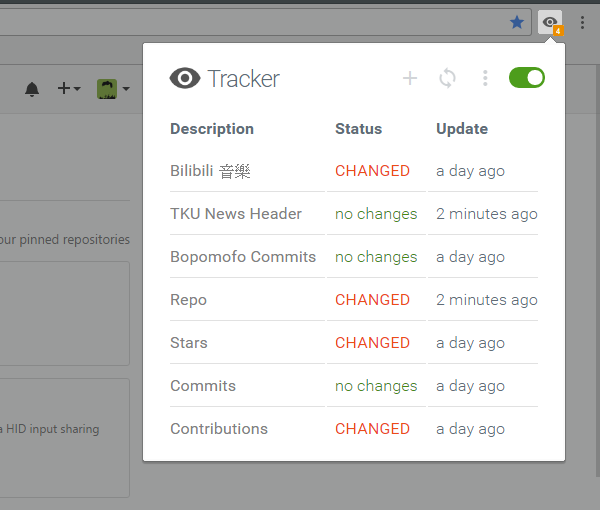

# Tracker

**Tracker** is a tool helps you fetch the changes of webpages effortlessly.

Now you don't have to refresh a page again and again checking whether there is something updated anymore.
Simply right click the element you interested and add it to tracker list. Then just sit back and relax,
**Tracker** will notify you if any changes detected.

Install Tracker from [Chrome Web Store](https://chrome.google.com/webstore/detail/web-element-watcher/nijeghmbfkeegaiihloeeknoidnajnlk)

## Screenshots

## How it works
[How it works](doc/how_it_works.md)

## It can NOT do (for now):
- Asynchronous loaded content
- Contents with uncertain position  

## License

MIT
