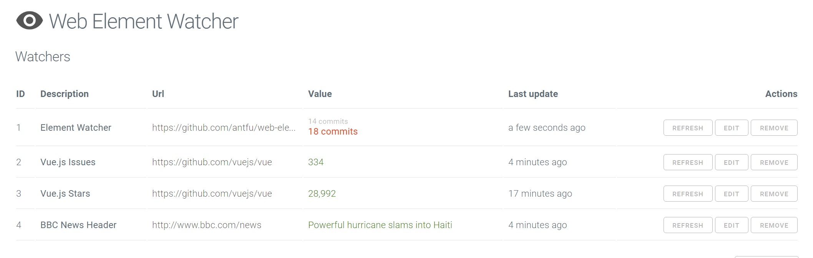
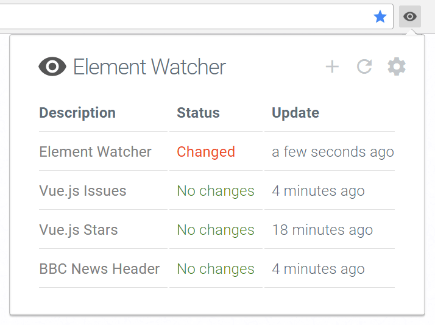

# Tracker

A web element tracker for websites.

## Install

⚠️ _Warning: This extension is still in development, it may contains unknown bugs and may have feature breakings in the future releases._

Install from [Chrome Web Store](https://chrome.google.com/webstore/detail/web-element-watcher/nijeghmbfkeegaiihloeeknoidnajnlk)

## Screenshots

**_Recently renamed to "Tracker"_**

## Todo

- [x] Request checking ( with out tabs )
- [ ] Background checking ( also an option for it )
- [ ] Notifications
- [ ] Badges for changed items
- [ ] Tracker list for tracked url
- [ ] More options on "New Tracker" page
- [ ] Add "Checking" status to dashboard
- [ ] Import

## License

MIT
